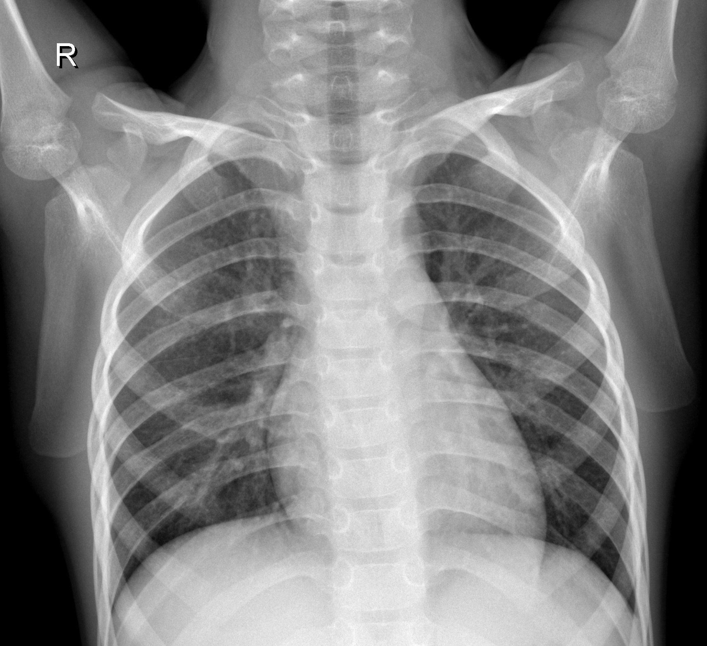
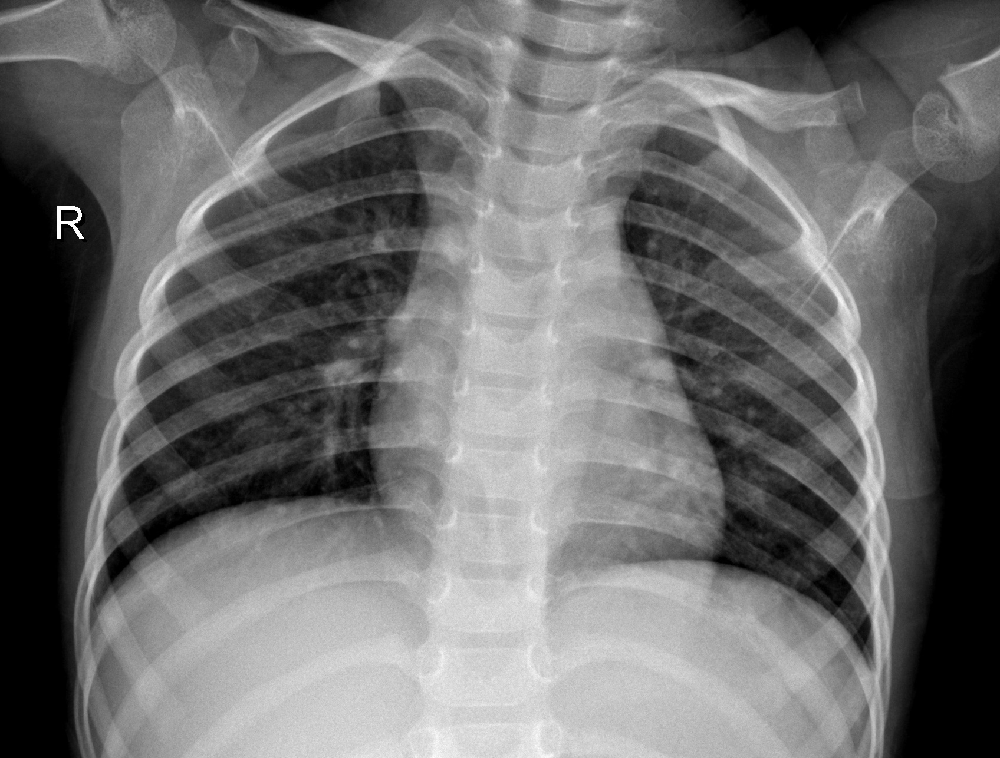
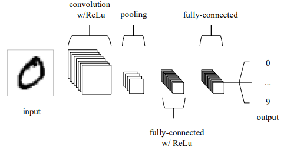
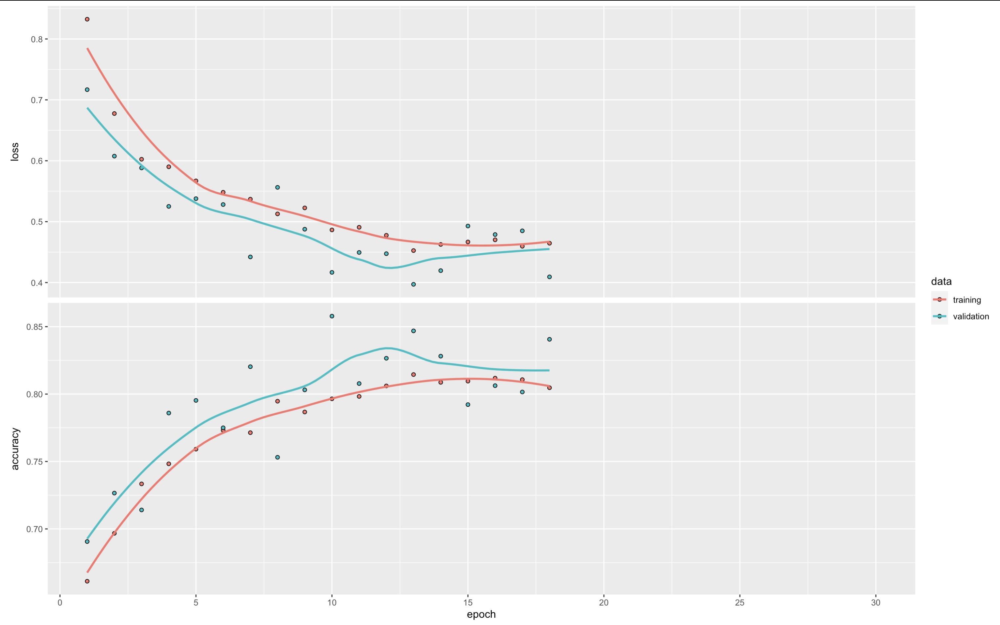

```{=html}
<style type="text/css">

h1.title {
  font-size: 40px;
  color: Black;
  text-align: center;
}
h3.subtitle {
  font-size: 30px;
  color: Grey;
  text-align: center;
}
h4.author { /* Header 4 - and the author and data headers use this too  */
  font-size: 20px;
  font-family: "Times New Roman", Times, serif;
  color: Grey;
  text-align: center;
}

figure{text-align: center; max-width: 40%; margin:0;padding: 10px;}
figure img{width: 100%;}
body{
  font-family: Helvetica;
  font-size: 14pt;
}
</style>
```
# 1. Introduction

In the last three years or so, the need to diagnose and manage patients
has become more urgent than ever due to the outbreak of the world's
coronavirus disease 2019 (COVID-19). Chest X-rays (CXRs), one of the
most primary imaging tools, are common, fast, non-invasive, relatively
cheap and may be used to track the disease's development [@cohen2020]. While
developing drugs to hinder virus prefoliation and new methods to assist
infected individuals, alongside making effective sanitary policies to
prevent virus spread are crucial endeavors of medical researchers, the
role of computer science, emphasized by its significant contributions
such as innovative technologies for virus diagnostics and tracking human
interactions, is equally vital in this fight against the virus
[@MARQUES2020106691].

Nowadays, scientists are employing Convolutional Neural Networks (CNN),
a class of deep learning neural networks for multiple applications. In
the 1860s, Wiesel and Hubel [@wiesel] studied the visual cortex cells of
cats and found that each visual neuron processes only a small area of
the visual image, the Receptive Field. And inputting the entire pixel
data to traditional Neural Network is highly inefficient and
computationally demanding. This inspired the concept of convolutional
neural networks (CNNs), a powerful and effective tool for image
classification because of its high accuracy. CNNs aim to automatically
learn relevant features from images by using an input layer, an output
layer, and hidden layers. Typically, the hidden layers comprise
convolutional layers, ReLU layers, pooling layers, and fully connected
layers. CNNs marks a significant breakthrough in automatic image
classification systems as that bypass the need for pre-processing of
images that wa a requirement in conventional machine learning algorithms
[@MARQUES2020106691].

The primary goal of our project is to develop a Convolutional Neural
Network (CNN)-based system for the classification of X-ray images. We
will provide a comprehensive explanation of what CNNs are and how they
operate within this context. During the training and testing phase, the
dataset has been divided into separate parts, which helps to validate
the proposed CNN models and helps prevent overfitting, a common issue in
machine learning models. The multi-class classification using images
from patients with COVID-19, pneumonia, and those who are healthy, are
discussed.

# 2. Dataset Description and Sources

The data we use is a clean dataset from kaggle website. These images are
collected from various publicly available resources:

-   COVID-19 image data collection [@cohen2020]
    <https://github.com/ieee8023/covid-chestxray-dataset>

-   Labeled Optical Coherence Tomography (OCT) and Chest X-Ray Images
    for Classification [@KERMANY2018]
    <https://data.mendeley.com/datasets/rscbjbr9sj/2>

-   COVID-Net Open Source Initiative [@Wang2020]
    <https://github.com/lindawangg/COVID-Net>

The first source, is the initial publicly accessibel COVID-19 image
dataset, which is the biggest publicly available source for COVID-19
picture, offering a comprehensive collection of hundreds of frontal view
X-ray images [@cohen2020]. The second dataset source collected and labels
chest X-ray images from children, which includes 3,883 instances of
pneumonia and 1,349 normal cases, taken from a total of 5,856 patients
[@KERMANY2018]. The third dataset source comes from COVID-Net open
source initiative, providing a collection of chest X-ray images for
different categories: no pneumonia, non-COVID-19 pneumonia, and COVID-19
pneumonia, taken from over 16,400 patients [@Wang2020].

The cleaned curated dataset from Kaggle, available at
<https://www.kaggle.com/code/faressayah/chest-x-ray-medical-diagnosis-with-cnn-densenet/input?select=Data>,
has arranged and split the above three dataset sources into two folders:
'train', 'test'. Each of these folders contains three subfolders,
representing three categories: 'COVID-19', 'PNEUMONIA', and 'NORMAL'.
The dataset includes a total of 6,432 X-ray images, with the test data
constituting 20% of the total images. The following are a few examples
from each category.

<p align="center">


 <br>
<font size = "2">Fig.1: COVID-19</font>
</p>

<p align="center">


 <br> 
<font size = "2">Fig.2: PNEUMONIA</font>
</p>

<p align="center">



 <br>
<font size = "2">Fig.3: NORMAL</font>
</p>


# 3. Understanding Convolutional Neural Networks

Convolutional Neural Network (CNN) is one kind of deep nural networks. The
capacity to classify images and identify objects in a picture has
improved significantly with the development of convolutional neural
networks [@DBLP2013]. Convolutional neural employs a special kind of
method which is being known as convolution. Suppose we have two
measurable functions on $\mathbb{R}^n$, $f$ and $g$, convolution is
defined as: 

$$(f*g)(t)=\int_{-\infty}^\infty f(\tau)g(t-\tau)d\tau$$

The following figure dipicts three distinct types of layers in CNNs: Convolutional, Pooling, and Fully-connected layers. Stacking these layers together forms a complete CNN architecture. As an example, Fig.4 depicts a simplified CNN architecture designed for MNIST digit classification[@DBLP2015].

<p align="center">
 
<br>
<font size = "2">Fig.4: An simple CNN architecture, comprised of just five layers [@DBLP2015]</font>
</p>

## 3.1 Convolutional Layer
A main difference between traditional Artificial Neural Networks (ANN) and Convolutional Neural Networks (CNN) lies in the dimensional structure of their layers. In CNNs, layers possess three dimensions - height, width, and depth, where 'depth' refers to the third dimension of an activation volume [@DBLP2015]. Consider the following fully connected layers in Fig.5, where each neuron in one layer connects to every neuron in the adjacent layer [@nielsen2015]. However, this design in ANNs does not take into account the spatial structure of images, treating input pixels that are both far apart and close together in an identical manner, which may hamper the network's ability to efficiently process image data [@nielsen2015].

<p align="center">
 
<br>
<font size = "2">Fig.5: Fully-connected Layers [@nielsen2015]</font>
</p>

In contrast, CNNs only focus on local region of an image. Convolution is applied to a small region of an image, referred to as <b>'receptive field' or 'local region'</b> instead of the entire image. As illustrated in Fig.7, to enhance efficiency, the hidden neurons in the next layer only get inputs from the corresponding part of the previous layer [@8308186]. This approach not only reduces computational requirements but also helps in recognizing spatial hierarchies within an image (Fig.6) [@8308186].

<p align="center">
&nbsp;&nbsp;&nbsp;&nbsp;

<br> 
<font size = "2">Fig.6: Three dimensional input representation of CNN</font> &nbsp;&nbsp;&nbsp;&nbsp;&nbsp;&nbsp; <font size = "2">Fig.7: Convolution as alternative for fully connected network</font>
</p>

Despite having significantly fewer connections than fully connected layers, convolutional layers also offer advantages due to another simplifying assumption, known as the <b>'stride'</b> [@8308186]. Fig.8 shows that the local receptive field being moved by one pixel each time. Setting a larger number of the stride will reduce overlapping and obtain an output of lower spatial dimensions.

<p align="center">
 
<br>
<font size = "2">Fig.8: Stride 1 [@8308186]</font>
</p>

In addition, we can optimize our model by assuming the local connection weights are fixed for all neurons of the next layer [@8308186]. In other words, the network have <b>shared weights and biases</b>. According to @nielsen2015, suppose there is a $5\times 5$ region, corresponding to 28 input pixels, then there will be $24\times24$ hidden neurons. For the j,kth hidden neuron, the output is 
$$\sigma((b+\sum_{i=0}^4\sum_{m=0}^4w_{l,m}a_{j+l,k+m})),$$

where $\sigma$ is the active function, b is the shared bias, $w_{l,m}$ is the shared wights and $a_{x,y}$ is the input activation at position x, y. This equation is essentially a form of the convolution we described above. The shared weights and bias are also known as <b>kernel or filter</b>. This approach can greatly reduce the number of parameters.

## 3.2 Pooling Layer
Pooling layers aims to simplify the output from the convolutional layer, thus further reduce the number of parameters and the computational complexity [@DBLP2015]. It can be considered as lowering the resolytion in the context of image processing [@8308186]. <b>Max-pooling</b> is one of the most popular way of pooling methods, identifies the presence of a specific feature within a defined image region [@nielsen2015]. Other notable pooling strategies include <b>overlapping pooling</b>, <b>L2 pooling</b> and <b>general pooling</b>, each offering unique advantages in different cotexts.

## 3.3 Fully-connected Layer
The fully-connected layer consists of neurons that are directly linked to neurons in the immediate preceding and succeeding layers, This structure echoes the neuron arrangement found in conventional Artificial Neural Networks (ANNs), as depicted in Fig.5.


# 4. Applictaions

## 4.1 Data Augmentation
Before deploying our model on the training dataset, we recognized a deficiency in our quantity of image data.

To address this problem, we incorporated an image data generator, which is basically a form of data augmentation techniques specifically tailored to image data. This would effectively increase the size of train data set to booster the robustness of the model training process. In the <b>keras</b> package, the function <b>image_data_genertor()</b> completes such task. This function allows us to define specific transformations for our images. We can, for instance, flip the images both horizontally and vertically, alter the contrast and hue, zoom in or out, shear the image, and adjust the brightness. For our data, we implemented the following transformations:

- Rescaling by a factor of 1/255

- Shifting the width and height by a factor of 0.2

- Shearing and zooming by a factor of 0.2

- Applying both horizontal and vertical flips

- Whitening the image and adjusting the brightness range to 0.2.

Through these modifications, we were able to effectively increase our dataset size and improve our model's training capabilities.

## 4.2 Dataset Building
After data augmentation, we are to establish objects as image train and test datasets. It is the specific type of format that <b>keras</b> identify as train data input. This reduces the amount of work for users to load each images from folders into the environment and the model could directly call the data from the established directory. We are creating two generators, one each for train and test data. It's important to set the input size of images beforehand to restrict the dimensions, ensuring a reasonable training time. We also set the batch size parameter to be 32, which means that we allow the model to handle 32 images in one training loop. This mini-batch technique would reduce the memory size required for training while also making training process faster as the number of parameters it needs to update (weights and bias) is significantly smaller. In addition, we established the color mode to be 'RGB', a three-color regulation as opposed to grayscale. We chose this because we identified color images in the dataset during our exploration, despite the fact that most typical medical images, especially CT scans, are black and white. By calling the generator part within the setting, we implemented the previous constructed image generator to get augmented image datasets. The last but most important feature is the class_mode. Here we identified it as 'categorical' since we are dealing with a three-level labeling: COVID-19, Normal lungs, and Pneumonia lungs.

We also performed a step of computing class proportion in the fully construed dataset to make sure that we have matching proportion of images as the original data that we acquired.

## 4.3 Simple Model

We constructed the sequential model using tidy format under <b>keras</b> in R. As denoted above, the model is a combination of three component: input layer, hidden layers (consisting of convolution layer and pooling layer), and an output layer.  All the convolution layers are using the activation function of 'ReLu', which is defined as:
$$f(x)=max(0,z).$$

Our training protocol begins with a simple model to test feasibility and troubleshoot potential issues. 

The simple model has one convolution layer with a filter size being 16 and and a kernel size $3\times 3$. Given that we have made the input images to be a dimension of $64\times 64$, the filter size is proportionate to this dimension. After this, we appended a max pooling layer to wrap up information gained from convolution layer by pool the maximum number of each filer shift. Then the convolution part is flattened and moved on to dense layer. Here we have two layers, receptively with 16 and 32 nodes.

The final layer, our output layer, is a dense layer with three units, corresponding ro our three labels:  'COVID-19', 'PNEUMONIA', and 'NORMAL'. We set the activation function to be softmax so that the model will finally give its prediction of probabilities for each label of any given image. And the three probabilities should sum up to 1.  For a multi-class label classification, softmax function is defined as:
$$\sigma(z_i) = \frac{e^{z_{i}}}{\sum_{j=1}^K e^{z_{j}}} \ \ \ for\ i=1,2,\dots,K$$

Now that we are finally able to compile the model with our constructed train and test dataset from the last section. We specified the loss function to be 'categorical_crossentropy', and optimization algorithm to be Adam with a learning rate of 0.0001. <b>TensorFlow</b> enables a great deal of flexibility here that user can try out different optimization algorithm and learning rate. And we also want the model to output accuracy so that we could evaluate.

Let's fit the mode with train data and evaluate on test data! The number epochs is set to be 30, which means the training process will go through the entire train data 30 times. To accelerate training time, we added the option of multiprocessing and an early stopping criteria by patience being 5 in terms of accuracy check, so that the model train will stop earlier if detected convergence.

The following Fig.8 provides a summary of our model.

<p align="center">
 
<br>
<font size = "2">Fig.8: Simple Model </font>
</p>

After training, we can see that the accuracy for the simple model is stabilized around 0.8 with a loss around 0.45. Its performance is slightly better on the test data, achieving an accuracy of approximately 0.84 and a loss around 0.40. We can see the process of training in Fig.9 and the training is stopped at the 18th epoch.Having confirmed the feasibility of our model architecture, we are now prepared to proceed with model selection and pruning, taking advantage of the flexibility offered by the <b>keras</b> package.

<p align="center">
 
<br>
<font size = "2">Fig.9: Result of Simple Model</font>
</p>

## 4.4 Model Pruning

To enhance the capability of the model, We would like to increase the complexity of the model by adding more convolution layers and pooling layers, while increasing the size of the filters to maintain a larger feature extraction area so that the model may obtain more features.

The input layer is now  a convolution layer with 32 filters and a kernel size of $3 \times 3$. The input shape should be specified and matched what we set beforehand. We have input dimension of $64 \times 64 \times 3$, since we expect the input images to be of dimension $64 \times 64$ in RGB. For grayscale images, we would use 1 in this block instead. We also added an element to 'stride' so that there's one unit shifting in the input layer. As before, a pooling layer follows each convolution layer to encapsulate the extracted feature information.

The model now includes three convolution layers, with 64, 128, and 128 filters respectively. This is simply the result of our exploration and training, users can have their own exploration over the layers and number of filters to train the model. By inserting a flatten layer, we are end with the convolution part and moved on to the typical networks to perform classification assignment.

Beginning with a dropout layer of 0.5, we added two dense layers with units 128 and 64. This would convert information of image features to make classification task. 

The final output layer is a dense layer with three units, since we have three labels, reflecting our three labels. We've retained the softmax activation function to provide probabilistic predictions for each label of a given image.

Similar to the simple model, we compile the new model with exactly the same settings, except that we set the epoch size to 50. Since we are training a significantly larger amound of parameters, we would expect the training to converge later. 

In the model summary page (Fig.10), we can see that there are a total of 314,947 parameters to prune with respect to the 247,123 parameters of the simple model.

<p align="center">
 
<br>
<font size = "2">Fig.10: New Model</font>
</p>

As a result of training, the model demonstrates improved accuracy. It has now achieved approximately 0.90 of accuracy and a loss 0.25. This indicates the fact that enhancing the model by adding more layers can improve its performance. However, it is also important to balance this against potential increases in running time and the risk of overfitting, ensuring the model remains efficient and generalized.

<p align="center">
 
<br>
<font size = "2">Fig.11: Result of New Model</font>
</p>


## 4.5 Model Evaluation
Once the CNN model is built and trained, we would like to further test out its validity and accuracy on the previously spitted validation data set from training set. It is the set that has not been seen in the process of training and it is a great option to test if the model has overfitted on the training data.

To do so, we created a validate data set using the same approach when we created train and test dataset. We then evaluate the model's performance on this dataset using the <b>'evaluate()'</b> function provided by the <b>keras</b> package.

Our result shows that we achieved an accuracy of 0.9033 with a loss of 0.2606, which is approximately similar to the training process. It suggests our model generalizes well and has not overfitted the training data. This is a promising indication of the model's robustness and reliability.

# 5. Conclusion
In conlusion, our CNN model seems to exhibit robust performance in the classification of Chest X-rays. The complexity of the model, coupled with the use of data augmentation techniques, has significantly improved its ability to generalize and handle variations in the image data. Despite its strengths, there is still potential for improvement through exploration of different CNN architectures, more advanced data augmentation techniques and so on. Overall, our model serves as an effective tool in medical image analysis with promising opportunities for further enhancements.

# 6. Comparision to Other Approaches
In this section, we reviewed several existing methodologies and compared their outcomes.

In the study of @cohen2020, the goal was to utilize COVID-19 image data to develop AI-based approaches for predicting infection. They employed a pre-trained DenseNet model [@huang2017densely] from the <b>TorchRayVision</b> library [@cohen2020limits], achieving an AUC of approximately 74%.

@KERMANY2018 address the issue of data scarcity by employing a method of leveraging data known as transfer learning. Instead of training a entirely new blank network, they utilized a feed-forward network to fix the weights in the lower levels, which are already optimized to recognize common image structures. Then they retained the weights of the upper levels with back-propagation. Their approach enables the model to identify specific features unique to a particular category of images, thus accelerating the training process. Their transfer learning algorithm obtained results that when differentiating between pneumonia and normal chest X-rays, the model achieved an accuracy of 92.8%, with a sensitivity of 93.2% and a specificity of 90.1%. 

@Wang2020 developed COVID-Net, a deep convolutional neural network design specifically designed to detect COVID-19 cases from chest X-rays. TThey employed residual architecture design principles to make the same three predictions as our final project. The initial network design prototype was guided by data and specific human design requirements, which is used to construct the final deep neural network architecture.  Their model demonstrated good sensitivity for COVID-19 cases, with a sensitivity rate of 91.0%.

# 7. Future Work
There are various paths we may follow for future work given our experience with the current project and the knowledge we've learned about CNNs:

<b>1. Padding</b>: The loss of information that may reside on the image's border is one of the cons of the convolution stage [@8308186]. Padding is a technique that can help preserve the spatial dimensions of the image after convolution. One common and simple process is <b>zero-padding</b>, which pads the border of the input and controls the output size [@DBLP2015].

<b>2. Different Architectures</b>: In our final project, the model employees a straightforward CNN structure. We could consider experimenting with different architectures in the future, such as Residual Networks (ResNets), Inception Networks, or Dense Convolutional Networks (DenseNets). These architecture has been verified to be effective in the classification of Chest-X ray images [@cohen2020].

<b>3. Transfer Learning</b>: Transfer learning is to use pre-trained models that have been trained on large datasets. @KERMANY2018  employee this architecture in their work.

<b>4. Data Augmentation Techniques</b>: We could further explore data augmentation techniques to create a more robust model that can handle a variety of image conditions. For example, deep representations may be learned using generative adversarial networks (GANs) without the need for a large amount of annotated training data [@8308186]. 

<b>5. Other Performance Metrics</b>: Sometimes accuracy is not the best metric, especially for imbalanced datasets. In future, we could use other metrics like precision, recall, F1 score, or Area Under the Receiver (AUC) and Operating Characteristic (ROC) curves to provide a more comprehensive evaluation.

By incorporating these considerations, we can continue to refine and enhance our model, driving towards greater performance, efficiency, and robustness in a variety of medical images.

# Contact

If you have any questions, feel free to contact us!

Yu Yan: yu_yan@brown.edu

Zihan Zhou: zihan_zhou1@brown.edu

You can find the full code for this final project here: https://github.com/Rosy98/PHP2650-Final-Project

# Reference
