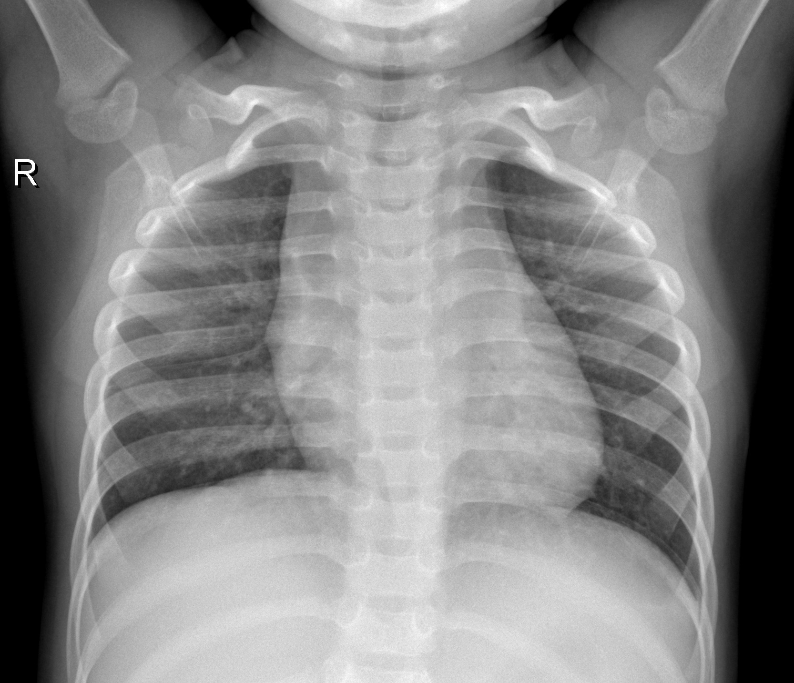

```{=html}
<style type="text/css">

h1.title {
  font-size: 45px;
  color: Black;
  text-align: center;
}
h4.author { /* Header 4 - and the author and data headers use this too  */
    font-size: 20px;
  font-family: "Times New Roman", Times, serif;
  color: Grey;
  text-align: center;
}

figure{text-align: center; max-width: 40%; margin:0;padding: 10px;}
figure img{width: 100%;}
body{
  font-family: Helvetica;
  font-size: 15pt;
}
</style>
```
# 1. Introduction

In the last three years or so, the need to diagnose and manage patients
has become more urgent than ever due to the outbreak of the world's
coronavirus disease 2019 (COVID-19). Chest X-rays (CXRs), one of the
most primary imaging tools, are common, fast, non-invasive, relatively
cheap and may be used to track the disease's development [@melba]. While
developing drugs to hinder virus prefoliation and new methods to assist
infected individuals, alongside making effective sanitary policies to
prevent virus spread are crucial endeavors of medical researchers, the
role of computer science, emphasized by its significant contributions
such as innovative technologies for virus diagnostics and tracking human
interactions, is equally vital in this fight against the virus
[@MARQUES2020106691].

Nowadays, scientists are employing Convolutional Neural Networks (CNN),
a class of deep learning neural networks for multiple applications. In
the 1860s, Wiesel and Hubel [@wiesel] studied the visual cortex cells of
cats and found that each visual neuron processes only a small area of
the visual image, the Receptive Field. And inputting the entire pixel
data to traditional Neural Network is highly inefficient and
computationally demanding. This inspired the concept of convolutional
neural networks (CNNs), a powerful and effective tool for image
classification because of its high accuracy. CNNs aim to automatically
learn relevant features from images by using an input layer, an output
layer, and hidden layers. Typically, the hidden layers comprise
convolutional layers, ReLU layers, pooling layers, and fully connected
layers. CNNs marks a significant breakthrough in automatic image
classification systems as that bypass the need for pre-processing of
images that wa a requirement in conventional machine learning algorithms
[@MARQUES2020106691].

The primary goal of our project is to develop a Convolutional Neural
Network (CNN)-based system for the classification of X-ray images. We
will provide a comprehensive explanation of what CNNs are and how they
operate within this context. During the training and testing phase, the
dataset has been divided into separate parts, which helps to validate
the proposed CNN models and helps prevent overfitting, a common issue in
machine learning models. The multi-class classification using images
from patients with COVID-19, pneumonia, and those who are healthy, are
discussed.

# 2. Dataset Description and Sources

The data we use is a clean dataset from kaggle website. These images are
collected from various publicly available resources:

-   COVID-19 image data collection [@melba]
    <https://github.com/ieee8023/covid-chestxray-dataset>

-   Labeled Optical Coherence Tomography (OCT) and Chest X-Ray Images
    for Classification [@Kermany2018b] [@KERMANY2018]
    <https://data.mendeley.com/datasets/rscbjbr9sj/2>

-   COVID-Net Open Source Initiative [@Wang2020]
    <https://github.com/lindawangg/COVID-Net>

The first source, is the initial publicly accessibel COVID-19 image
dataset, which is the biggest publicly available source for COVID-19
picture, offering a comprehensive collection of hundreds of frontal view
X-ray images [@melba]. The second dataset source collected and labels
chest X-ray images from children, which includes 3,883 instances of
pneumonia and 1,349 normal cases, taken from a total of 5,856 patients
[@KERMANY2018]. The third dataset source comes from COVID-Net open
source initiative, providing a collection of chest X-ray images for
different categories: no pneumonia, non-COVID-19 pneumonia, and COVID-19
pneumonia, taken from over 16,400 patients [@Wang2020].

The cleaned curated dataset from Kaggle, available at
<https://www.kaggle.com/code/faressayah/chest-x-ray-medical-diagnosis-with-cnn-densenet/input?select=Data>,
has arranged and split the above three dataset sources into two folders:
'train', 'test'. Each of these folders contains three subfolders,
representing three categories: 'COVID-19', 'PNEUMONIA', and 'NORMAL'.
The dataset includes a total of 6,432 X-ray images, with the test data
constituting 20% of the total images. The following are a few examples
from each category.

<p align="center">


 <br>
<font size = "2">Fig.1: COVID-19</font>
</p>

<p align="center">


 <br> 
<font size = "2">Fig.2: PNEUMONIA</font>
</p>

<p align="center">



 <br>
<font size = "2">Fig.3: NORMAL</font>
</p>


# 3. Understanding Convolutional Neural Networks

Convolutional Neural Network (CNN) is one kind of deep nural networks. The
capacity to classify images and identify objects in a picture has
improved significantly with the development of convolutional neural
networks [@DBLP2013]. Convolutional neural employs a special kind of
method which is being known as convolution. Suppose we have two
measurable functions on $\mathbb{R}^n$, $f$ and $g$, convolution is
defined as: 

$$(f*g)(t)=\int_{-\infty}^\infty f(\tau)g(t-\tau)d\tau$$

The following figure dipicts three distinct types of layers in CNNs: Convolutional, Pooling, and Fully-connected layers. Stacking these layers together forms a complete CNN architecture. As an example, Fig.4 depicts a simplified CNN architecture designed for MNIST digit classification[@DBLP2015].

<p align="center">
 
<br>
<font size = "2">Fig.4: An simple CNN architecture, comprised of just five layers [@DBLP2015]</font>
</p>

## 3.1 Convolutional Layer
A main difference between traditional Artificial Neural Networks (ANN) and Convolutional Neural Networks (CNN) lies in the dimensional structure of their layers. In CNNs, layers possess three dimensions - height, width, and depth, where 'depth' refers to the third dimension of an activation volume [@DBLP2015]. Consider the following fully connected layers, where each neuron in one layer connects to every neuron in the adjacent layer [@nielsen2015]. However, this design in ANNs does not take into account the spatial structure of images, treating input pixels that are both far apart and close together in an identical manner, which may hamper the network's ability to efficiently process image data [@nielsen2015].

<p align="center">
 
<br>
<font size = "2">Fig.5: Fully-connected Layers [@nielsen2015]</font>
</p>

In contrast, CNNs only focus on local region of an image. Convolution is applied to a small region of an image, referred to as <b>'receptive field' or 'local region'</b> instead of the entire image. As illustrated in Fig.7, to enhance efficiency, the hidden neurons in the next layer only get inputs from the corresponding part of the previous layer [@8308186]. This approach not only reduces computational requirements but also helps in recognizing spatial hierarchies within an image (Fig.6)[@8308186].

<p align="center">
&nbsp;&nbsp;&nbsp;&nbsp;

<br> 
<font size = "2">Fig.6: Three dimensional input representation of CNN</font> &nbsp;&nbsp;&nbsp;&nbsp;&nbsp;&nbsp; <font size = "2">Fig.7: Convolution as alternative for fully connected network</font>
</p>

Despite having significantly fewer connections than fully connected layers, convolutional layers also offer advantages due to another simplifying assumption, known as the <b>'stride'</b> [@8308186]. Fig.8 shows that the local receptive field being moved by one pixel each time. Setting a larger number of the stride will reduce overlapping and obtain an output of lower spatial dimensions.

<p align="center">
 
<br>
<font size = "2">Fig.8: Stride 1 [@8308186]</font>
</p>

In addition, we can optimize our model by assuming the local connection weights are fixed for all neurons of the next layer [@8308186]. In other words, the network have <b>shared weights and biases</b>. According to @nielsen2015, suppose there is a $5\times 5$ region, corresponding to 28 input pixels, then there will be $24\times24$ hidden neurons. For the j,kth hidden neuron, the output is 
$$\sigma((b+\sum_{i=0}^4\sum_{m=0}^4w_{l,m}a_{j+l,k+m})),$$

where $\sigma$ is the active function, b is the shared bias, $w_{l,m}$ is the shared wights and $a_{x,y}$ is the input activation at position x, y. This equation is essentially a form of the convolution we described above. The shared weights and bias are also known as <b>kernel or filter</b>. This approach can greatly reduce the number of parameters.

## 3.2 Pooling Layer
Pooling layers aims to simplify the output from the convolutional layer, thus further reduce the number of parameters and the computational complexity [@DBLP2015]. It can be considered as lowering the resolytion in the context of image processing [@8308186]. <b>Max-pooling</b> is one of the most popular way of pooling methods, identifies the presence of a specific feature within a defined image region [@nielsen2015]. Other notable pooling strategies include <b>overlapping pooling</b>, <b>L2 pooling</b> and <b>general pooling</b>, each offering unique advantages in different cotexts.

## 3.3 Fully-connected Layer
The fully-connected layer consists of neurons that are directly linked to neurons in the immediate preceding and succeeding layers, This structure echoes the neuron arrangement found in conventional Artificial Neural Networks (ANNs), as depicted in Fig.5.


# 4. Applictaions

## 4.1 Data Augmentation
Before deploying our model on the training dataset, we recognized a deficiency in our quantity of image data.

To address this problem, we incorporated an image data generator, which is basically a form of data augmentation techniques specifically tailored to image data. This would effectively increase the size of train data set to booster the robustness of the model training process. In the <b>keras</b> package, the function <b>image_data_genertor()</b> completes such task. This function allows us to define specific transformations for our images. We can, for instance, flip the images both horizontally and vertically, alter the contrast and hue, zoom in or out, shear the image, and adjust the brightness. For our data, we implemented the following transformations:

- Rescaling by a factor of 1/255

- Shifting the width and height by a factor of 0.2

- Shearing and zooming by a factor of 0.2

- Applying both horizontal and vertical flips

- Whitening the image and adjusting the brightness range to 0.2.

Through these modifications, we were able to effectively increase our dataset size and improve our model's training capabilities.

## 4.2 Model Structure
we have constructed this sequential model using the tidy format under the package <b>keras</b> in R. As denoted above, the model comprises three main components: input layer, hidden layers (consisting of convolution layer and pooling layer), and an output layer. All the convolution layers are using the activation function of 'ReLu', which is defined as:
$$f(x)=max(0,z).$$

The input layer is a convolution layer with 32 filters and a kernel size of $3\times3$. The input shape need to be specified and matched the configuration we set beforehand. We have input size of $64\times64\times3$ since we expect the input image to be at dimension of 64 by 64 with RGB color. If setting color as grey scale, we would instead insert 1 at this block.Following each convolution layer, we add a pooling layer to wrap up the feature information extracted by the convolution layer filtering. 

The model then includes three convolution layers with filter numbers 64,128,and 128 respectively. This is simply the result of our exploration and training, and users are free to experiment with different layer structures and filter quantities for model training. By inserting a flatten layer, we are end with the convolution part and moved on to the typical networks to perform classification assignment.

Start with a drop out layer of 0.5, we added two dense layer with 128 and 64 units respectively. This would convert information of image features to make classification task. 

The final layer, our output layer, is a dense layer with three units,  corresponding to the three labels in our data: 'COVID-19', 'PNEUMONIA', and 'NORMAL'. We set the activation function to be 'softmax' so that the model will finally give its prediction of probabilities for each label of a given image. And the three probabilities should sum up to 1. For a multi-class label classification, softmax function is defined as:
$$\sigma(z_i) = \frac{e^{z_{i}}}{\sum_{j=1}^K e^{z_{j}}} \ \ \ for\ i=1,2,\dots,K$$

Now that we are finally able to compile the model with our constructed train and test dataset from the last section. We specify the loss function to be 'categorical_crossentropy', and optimization algorithm to be Adam with a learning rate of 0.0001. <b>TensorFlow</b> enables a great deal of flexibility here that users can try out different optimization algorithm and learning rate. We also request the model to output accuracy for evaluation purposes.

Finally, let's fit the mode with train data and evaluate on test data! The number of epochs is set to be 30, which means that the training process will go through the entire train data 30 times. To accelerate training time, we added the option of multiprocessing and included an early stopping criteria based on accuracy, with a patience level of 5. This ensures early termination of model training if convergence is detected.

# 5. Discussion

## 5.1 Results

## 5.2 Conclusion

# 6. Future Work

To be added.

# Reference
